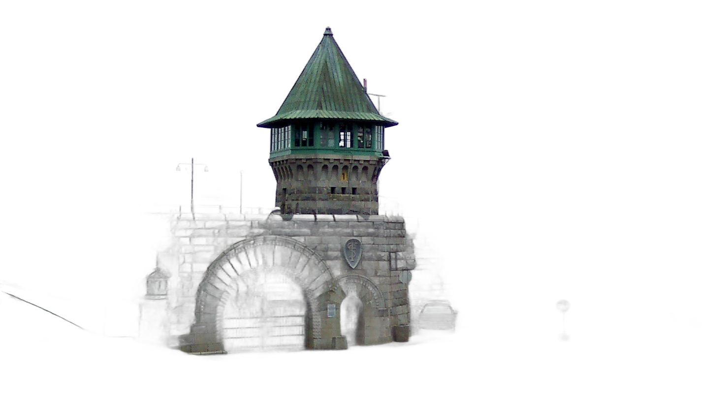
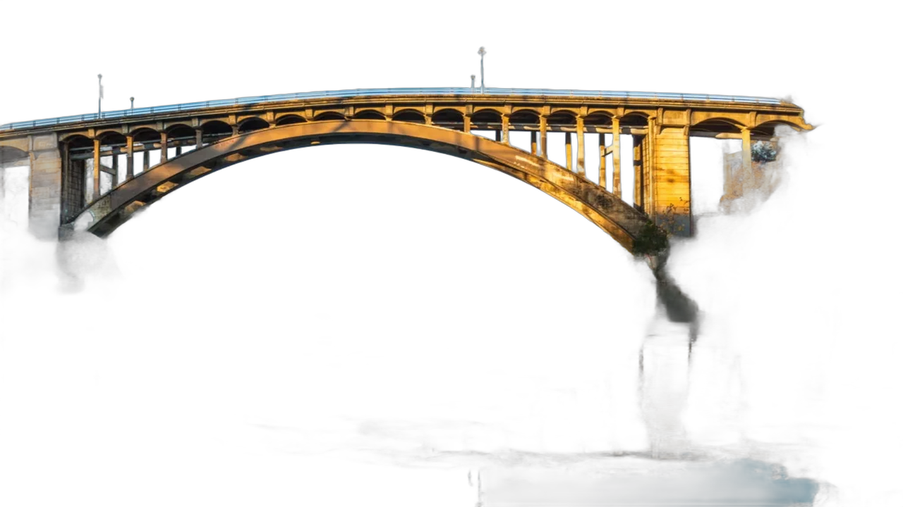
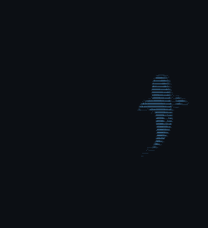

<pre>

⠀⠀⠀⠀⠀⠀⠀⠀⠀⠀⠀⠀⠀⠀⠀⠀⠀⠀⠀⠀⠀⠀⠀⠀⠀⠀⠀⠘⠳⢦⣀⠀⠀⠀⠀⠀⠀⠀⠀⠀⠀⠀⠀⠀⠀⠀⠀⠀⠀⠀⠀⠀⠀⠀⠀⠀⠀⠀
⠀⠀⠀⠀⠀⠀⠀⠀⠀⠀⠀⠀⠀⠀⠀⠀⠀⠀⠀⠀⠀⠀⠀⠀⠀⠀⠀⠀⠀⠀⠙⠻⣦⣀⠀⠀⠀⠀⠀⠀⠀⠀⠀⠀⠀⠀⠀⠀⠀⠀⠀⠀⠀⠀⠀⠀⠀⠀
⠀⠀⠀⠀⠀⠀⠀⠀⠀⠀⠀⠀⠀⠀⠀⠀⠀⠀⠀⠀⠀⠀⠀⠀⠀⠀⠀⠀⠀⠀⠀⠀⠈⢿⣧⡀⣠⣤⡄⠀⠀⠀⠀⠀⠀⠀⠀⠀⠀⠀⠀⠀⠀⠀⠀⠀⠀⠀
⠒⠓⠂⠀⠀⢀⣀⠐⠒⠛⠒⠀⠀⠀⠀⣠⣼⠗⢶⣾⡿⠷⣶⣶⣶⣶⣿⣿⣷⣶⣶⣶⣿⣿⣿⣿⣿⣿⠟⠀⠀⠀⠠⠄⠒⠤⠤⠄⠀⠀⢀⣀⡤⢄⡀⠀⠀⠀
⠀⠀⠀⠐⠉⠉⠀⠉⠁⠀⠀⠀⠀⠠⠞⠛⠋⠙⠛⠻⠿⣿⠿⠿⠿⠿⠿⠿⠛⠛⠿⠿⠿⣿⠿⠿⠿⢷⣶⣤⣤⣤⡤⠴⠾⠖⢂⣀⠤⠴⠦⢄⡀⠀⠀⠀⠀⠀
⠀⠀⠀⠀⠀⠀⠀⠀⠀⠀⠀⠀⠀⠀⠀⠀⠀⠀⠀⠀⠀⠀⠀⠀⠀⠠⠄⠒⠊⠑⠒⠤⠄⠀⠀⠀⠀⠀⠀⠀⠀⠀⠀⠀⠀⠀⠀⠀⠀⠀⠀⠀⠀⠀⠀⠀⠀⠀

⠀⠀⠀⠀⠀⠀⠀⠀⠀⠀⠀ ██████╗██╗  ██╗██╗   ██╗███╗   ███╗⠀⠀⠀⠀⠀⠀⠀⠀⠀⠀⠀
⠀⠀⠀⠀⠀⠀⠀⠀⠀⠀⠀██╔════╝██║  ██║██║   ██║████╗ ████║⠀⠀⠀⠀⠀⠀⠀⠀⠀⠀⠀
⠀⠀⠀⠀⠀⠀⠀⠀⠀⠀⠀██║     ███████║██║   ██║██╔████╔██║⠀⠀⠀⠀⠀⠀⠀⠀⠀⠀⠀
⠀⠀⠀⠀⠀⠀⠀⠀⠀⠀⠀██║     ██╔══██║██║   ██║██║╚██╔╝██║⠀⠀⠀⠀⠀⠀⠀⠀⠀⠀⠀
⠀⠀⠀⠀⠀⠀⠀⠀⠀⠀⠀╚██████╗██║  ██║╚██████╔╝██║ ╚═╝ ██║⠀⠀⠀⠀⠀⠀⠀⠀⠀⠀⠀
⠀⠀⠀⠀⠀⠀⠀⠀⠀⠀⠀ ╚═════╝╚═╝  ╚═╝ ╚═════╝ ╚═╝     ╚═╝⠀⠀⠀⠀⠀⠀⠀⠀⠀⠀⠀

⠀⠀⠀⠀⠀⠀⠀⠀⠀⠀⠀⠀⠀⠀⠀⠀████████╗██╗  ██╗███████╗⠀⠀⠀⠀⠀⠀⠀⠀⠀⠀⠀⠀⠀⠀⠀⠀⠀
⠀⠀⠀⠀⠀⠀⠀⠀⠀⠀⠀⠀⠀⠀⠀⠀╚══██╔══╝██║  ██║██╔════╝⠀⠀⠀⠀⠀⠀⠀⠀⠀⠀⠀⠀⠀⠀⠀⠀⠀
⠀⠀⠀⠀⠀⠀⠀⠀⠀⠀⠀⠀⠀⠀⠀⠀   ██║   ███████║█████╗⠀⠀⠀⠀⠀⠀⠀⠀⠀⠀⠀⠀⠀⠀⠀⠀⠀⠀⠀
⠀⠀⠀⠀⠀⠀⠀⠀⠀⠀⠀⠀⠀⠀⠀⠀   ██║   ██╔══██║██╔══╝⠀⠀⠀⠀⠀⠀⠀⠀⠀⠀⠀⠀⠀⠀⠀⠀⠀⠀⠀
⠀⠀⠀⠀⠀⠀⠀⠀⠀⠀⠀⠀⠀⠀⠀⠀   ██║   ██║  ██║███████╗⠀⠀⠀⠀⠀⠀⠀⠀⠀⠀⠀⠀⠀⠀⠀⠀⠀
⠀⠀⠀⠀⠀⠀⠀⠀⠀⠀⠀⠀⠀⠀⠀⠀   ╚═╝   ╚═╝  ╚═╝╚══════╝⠀⠀⠀⠀⠀⠀⠀⠀⠀⠀⠀⠀⠀⠀⠀⠀⠀

⠀⠀⠀██╗    ██╗ █████╗ ████████╗███████╗██████╗ ███████╗⠀⠀⠀⠀
⠀⠀⠀██║    ██║██╔══██╗╚══██╔══╝██╔════╝██╔══██╗██╔════╝⠀⠀⠀⠀
⠀⠀⠀██║ █╗ ██║███████║   ██║   █████╗  ██████╔╝███████╗⠀⠀⠀⠀
⠀⠀⠀██║███╗██║██╔══██║   ██║   ██╔══╝  ██╔══██╗╚════██║⠀⠀⠀⠀
⠀⠀⠀╚███╔███╔╝██║  ██║   ██║   ███████╗██║  ██║███████║⠀⠀⠀⠀
⠀⠀⠀ ╚══╝╚══╝ ╚═╝  ╚═╝   ╚═╝   ╚══════╝╚═╝  ╚═╝╚══════╝⠀⠀⠀⠀

⠀⠀⠀⠀⠀⠀⠀⠀⠀⠀⠀⠀⠀You're gonna need a bigger boat.⠀⠀⠀⠀⠀⠀⠀⠀⠀⠀⠀⠀⠀

</pre>

  

<h3 align="center">Hi 👋 I'm Brendan Welsh</h3>

<b>aka "<a href="https://chumthewaters.com">chumthewaters</a>"</b>

<i>tinkering since 1991 · vibin' since 2025</i>

<b>I bleed black and yellow with a side of purple.</b>

  <a href="https://www.linkedin.com/in/brendanwelsh">LinkedIn</a> &nbsp;·&nbsp; <a href="https://x.com/chumthewaters">X</a> &nbsp;·&nbsp; <a href="https://www.strava.com/athletes/164089">Strava</a>

**Tech enthusiast and vibe-coder.** I don't write code; I don't know a single programming language. I direct **Claude** and **Codex** to build the software and make the calls on architecture, taste, and what ships. My strengths are the systems *around* the code: **networking, infrastructure, architecture, and CI/CD**. Deep into smart home, homelab, streaming, audio and video production, gaming, and tech in general.

### Sacramento grown

Grew up between Folsom and Sacramento. Cut my teeth on MS-DOS playing **STUNTS**, **The Incredible Machine**, and **Lemmings**, with a **SNES** and a **GameCube** never far from reach.

  
  &nbsp;&nbsp;&nbsp;
  
  &nbsp;&nbsp;&nbsp;
  

### Career

Customer-facing, engineering-first. I live on the technical side of the relationship.

- **[Optimizely](https://www.optimizely.com)** · Experimentation engineering for enterprise customers: web + feature experiments, DOM- and SDK-based implementations, wired into their products.
- **[BigPanda](https://www.bigpanda.io)** · Value & Adoption Advisor. Drove technical adoption of the AIOps platform: integrations, event correlation, and monitoring pipelines.
- **[Aqua Security](https://www.aquasec.com)** · Technical Account Manager. Owned enterprise customers' container & Kubernetes security posture: image scanning, runtime protection, and policy.
- **[NEC Biometrics](https://www.nec.com/en/global/solutions/biometrics/index.html)** · Project Implementation Lead for enterprise biometrics & thermal systems at venues like Madison Square Garden, Radio City Music Hall, and Hard Rock Hollywood. Multi-server, GPU-accelerated, Docker-based deployments, everything from physical install to remote support.

### Off the clock

Endurance sport is the obsession: triathlon and cycling on a **[Canyon Aeroad CF SLX 8 Di2](assets/aeroad.png)**, logged on **[Strava](https://www.strava.com/athletes/164089)** with a **Garmin Edge 1050** and **Fenix 8**. Training has me **100+ lbs down**. It's on pause for now while I come back from L5-S1 herniation and spine surgery and rebuild my right side.

Pittsburgh sports to the core (**Steelers, Penguins, Pirates**) plus the **Sacramento Kings** out west, where I built **[Light the Beam](https://lightthebe.am)**. I'm **limited on every major sportsbook** (turns out they don't love a winner), never miss a UFC card, and tinker with home automation, cameras, security, and AI.

### Gaming

Been gaming online since the proximity-chat chaos of early **H1Z1** back in **2011**. Hit **Master** in League of Legends (June 2020 — top ~0.3% of players), and I run a Discord for the crew.

### Projects

**Stream Deck+ plugins**

- **[streamdeck-cameradials](https://github.com/brendanwelsh/streamdeck-cameradials)** — scroll RTSP / UniFi Protect cameras into mpv from a dial
- **[streamdeck-audioswap](https://github.com/brendanwelsh/streamdeck-audioswap)** — swap the default audio output + master volume from a dial

**Ulanzi**

- **[ulanzi-camera-switcher](https://github.com/brendanwelsh/ulanzi-camera-switcher)** — the cameradials idea, reborn on an Ulanzi dial
- **[ulanzi-synth](https://github.com/brendanwelsh/ulanzi-synth)** — Magic Trackpad + Ulanzi dial as a synth / groovebox
- **[ulanzi-d100h-homebrew](https://github.com/brendanwelsh/ulanzi-d100h-homebrew)** — reverse-engineering notes for the Ulanzi D100H dial
- **[ulanzi-pixel-clock-awtrix](https://github.com/brendanwelsh/ulanzi-pixel-clock-awtrix)** — guide + resources for the Ulanzi TC001 pixel clock and AWTRIX firmware

**Desktop**

- **[yasb-wallpaper-engine-color-sync](https://github.com/brendanwelsh/yasb-wallpaper-engine-color-sync)** — tint a YASB bar + taskbar to the active wallpaper

### Gamepad viewer skins

Skins for [gamepadviewer.com](https://gamepadviewer.com):

- **[elite-series-2-white](https://github.com/brendanwelsh/elite-series-2-white)** — Xbox Elite Series 2 (white) · [live »](https://brendanwelsh.github.io/elite-series-2-white/)
- **[playstation-ds5-white](https://github.com/brendanwelsh/playstation-ds5-white)** — DualSense (white) · [live »](https://brendanwelsh.github.io/playstation-ds5-white/)

### Sites I've shipped

| Site | What it is |
| :-- | :-- |
| **[caltraffic.com](https://caltraffic.com)** | 3,000+ live Caltrans traffic cameras + route planning across California |
| **[lightthebe.am](https://lightthebe.am)** | a real-time "did the Sacramento Kings light the beam?" tracker |
| **[glizzytime.com](https://glizzytime.com)** | every Nathan's Hot Dog Eating Contest champion since 1972, charted, with a live July 4 countdown |
| **[916notary.com](https://916notary.com)** | my Sacramento mobile notary service — Notary Public since 2015 |
| **[chumthewaters.com](https://chumthewaters.com)** | shark-themed fun page |

### Battlestation

Behind the desk: a **3× NUC Proxmox cluster** humming on a **UniFi** backbone, running **Plex** + the **\*arr** suite, **Nextcloud**, **Home Assistant**, and **Nginx Proxy Manager** / **Homarr** to tie it together. Self-hosted, gloriously over-engineered, and wired up in a way that probably shouldn't run as well as it does.

  

<a href="https://github.com/brendanwelsh/battlestation-evolution"><b>Click here to see the evolution of my battlestation »</b></a>

### Fav gear

- **[Keychron Q1 HE](https://www.keychron.com/products/keychron-q1-he-qmk-wireless-custom-keyboard)**
- **[Logitech G Pro X Superlight](https://www.logitechg.com/en-us/shop/p/pro-x-superlight-wireless-mouse)**
- **[MX Master 3](https://www.logitech.com/en-us/products/mice/mx-master-3.html)**
- **[Apple Magic Trackpad](https://www.apple.com/shop/product/MK2D3AM/A/magic-trackpad)**
- **[DualShock 4](https://www.playstation.com/en-us/accessories/dualshock-4-wireless-controller/)**
- **[Sony a5100](https://www.dpreview.com/products/sony/slrs/sony_a5100)**
- **[Elgato Cam Link](https://www.elgato.com/us/en/p/cam-link-4k)**
- **[Shure MV7](https://www.shure.com/en-US/products/microphones/mv7)**
- **[Elgato Key Light Mini](https://www.elgato.com/us/en/p/key-light-mini)**
- **[CalDigit TS4](https://www.caldigit.com/thunderbolt-station-4/)**
- **[Stream Deck XL](https://www.elgato.com/us/en/p/stream-deck-xl)**
- **[Stream Deck+](https://www.elgato.com/us/en/p/stream-deck-plus)**
- **[Ulanzi D100H dial](https://www.ulanzi.com/products/d100h-dial-creative-controller-i003)**
- **[Ulanzi TC001 clock](https://www.ulanzi.com/products/ulanzi-pixel-smart-clock-2882)**
- **[Garmin Fenix 8](https://www.garmin.com/en-US/p/1228429/)**

### Favorite open-source software

- **[Home Assistant](https://www.home-assistant.io)**
- **[OBS Studio](https://obsproject.com)**
- **[mpv](https://mpv.io)**
- **[komorebi](https://github.com/LGUG2Z/komorebi)** + **[whkd](https://github.com/LGUG2Z/whkd)** + **[YASB](https://github.com/amnweb/yasb)**
- **[Docker](https://www.docker.com)** + **[Saltbox](https://docs.saltbox.dev)**
- **[Tailscale](https://tailscale.com)**
- **[PowerToys](https://github.com/microsoft/PowerToys)** + **[VLC](https://www.videolan.org)**

### Music

Live music is the ritual — metalcore and hardcore in the pit, hip-hop, EDM, and whatever the Sacramento scene is throwing. Seen **Atmosphere** more times than I can count, plus **Killswitch Engage** and **Bassnectar**; you'll usually catch me at **[Ace of Spades](https://www.aceofspadessac.com/)** or **[Channel 24](https://channel24sac.com/)**. Everything from Bach to 2Pac, basically. Here's what's been spinning:

  
  &nbsp;&nbsp;&nbsp;&nbsp;&nbsp;&nbsp;&nbsp;&nbsp;
  

### Links

| Where | Link |
| :-- | :-- |
| **LinkedIn** | [linkedin.com/in/brendanwelsh](https://linkedin.com/in/brendanwelsh) |
| **X / Twitter** | [x.com/chumthewaters](https://x.com/chumthewaters) |
| **Strava** | [strava.com/athletes/164089](https://www.strava.com/athletes/164089) |
| **Personal** | [brendanw.com](https://brendanw.com) |
| **Shark stuff** | [chumthewaters.com](https://chumthewaters.com) |

### Stats

<pre>
⠀⠀⠀⠀⠀⠀⠀⠀⠀⠀⠀⠀⠀⠀⠀⠀⠀⠀⠀⠀⠀⠀⠀⠀⠀⠀⠀⠀⠀⣀⣀⡀⠀⠀⠀⠀⠀⠀⠀⠀⠀⠀⠀⠀⠀⠀⠀⠀⠀⠀⠀⠀⠀⠀⠀⠀⠀⠀
⠀⠀⠀⠀⠀⠀⠀⠀⠀⠀⠀⠀⠀⠀⠀⠀⠀⠀⠀⠀⠀⠀⠀⠀⠀⠀⣠⣶⣿⣿⣿⣿⣷⣦⡀⠀⠀⠀⠀⠀⠀⠀⠀⠀⠀⠀⠀⠀⠀⠀⠀⠀⠀⠀⠀⠀⠀⠀
⠀⠀⠀⠀⠀⠀⠀⠀⠀⠀⠀⠀⠀⠀⠀⠀⠀⠀⠀⠀⠀⠀⠀⠀⣴⣿⡿⠛⠉⠀⠀⠉⠻⣿⣿⣦⡄⠀⠀⠀⠀⠀⠀⠀⠀⠀⠀⠀⠀⠀⠀⠀⠀⠀⠀⠀⠀⠀
⠀⠀⠀⠀⠀⠀⠀⠀⠀⠀⠀⠀⠀⠀⠀⠀⠀⠀⠀⠀⠀⠀⣠⣾⣿⠏⠀⠀⠀⠀⠀⠀⠀⠈⠻⣿⣿⣦⡀⠀⠀⠀⠀⠀⠀⠀⠀⠀⠀⠀⠀⠀⠀⠀⠀⠀⠀⠀
⠀⠀⠀⠀⠀⠀⠀⠀⠀⠀⠀⠀⠀⠀⠀⠀⠀⠀⠀⠀⢀⣾⣿⡿⠁⠀⠀⠀⠀⠀⠀⠀⠀⠀⠀⠹⣿⣿⣿⣄⠀⠀⠀⠀⠀⠀⠀⠀⠀⠀⠀⠀⠀⠀⠀⠀⠀⠀
⠀⠀⠀⠀⠀⠀⠀⠀⠀⠀⠀⠀⠀⠀⠀⠀⠀⠀⠀⣰⣿⣿⣿⡁⠀⠀⠀⠀⠀⠀⠀⠀⠀⠀⠀⢸⣿⣿⣿⣿⣧⡀⠀⠀⠀⠀⠀⠀⠀⠀⠀⠀⠀⠀⠀⠀⠀⠀
⠀⠀⠀⠀⠀⠀⠀⠀⠀⠀⠀⠀⠀⠀⠀⠀⠀⢀⣼⣿⣿⡿⣿⠇⠀⠀⠀⠀⠀⠀⠀⠀⠀⠀⠀⠘⠃⠘⣿⣿⣿⣷⡄⠀⠀⠀⠀⠀⠀⠀⠀⠀⠀⠀⠀⠀⠀⠀
⠀⠀⠀⠀⠀⠀⠀⠀⠀⠀⠀⠀⠀⠀⠀⠀⢀⣾⣿⣿⡿⠁⠀⠀⠀⠀⠀⠀⠀⠀⠀⠀⠀⠀⠀⠀⠀⠀⠘⣿⣿⣿⣿⣄⠀⠀⠀⠀⠀⠀⠀⠀⠀⠀⠀⠀⠀⠀
⠀⠀⠀⠀⠀⠀⠀⠀⠀⠀⠀⠀⠀⠀⠀⢠⣾⣿⣿⡿⠁⠀⠀⠀⠀⠀⠀⠀⠀⠀⠀⠀⠀⠀⠀⠀⠀⠀⠀⠈⢿⣿⣿⣿⣆⠀⠀⠀⠀⠀⠀⠀⠀⠀⠀⠀⠀⠀
⠀⠀⠀⠀⠀⠀⠀⠀⠀⠀⠀⠀⠀⠀⢀⣿⣿⣿⡿⠁⠀⠀⠀⠀⠀⠀⠀⠀⠀⠀⠀⠀⠀⠀⠀⠀⠀⠀⠀⠀⠀⠻⢿⣿⣿⣛⣦⡀⠀⠀⠀⠀⠀⠀⠀⠀⠀⠀
⠀⠀⠀⠀⠀⠀⠀⠀⠀⠀⠀⠀⢠⣞⣿⣿⡿⠋⠀⠀⠀⠀⠀⠀⠀⠀⠀⠀⠀⠀⠀⠀⠀⠀⠀⠀⠀⠀⠀⠀⠀⠀⠀⠙⢿⣿⣿⡇⠀⠀⠀⠀⠀⠀⠀⠀⠀⠀
⠀⠀⠀⠀⠀⠀⠀⠀⠀⠀⠀⠀⣿⣿⣿⠋⠀⠀⠀⠀⠀⠀⠀⢀⣀⣀⣀⣤⣴⣾⣶⣤⣤⣄⣀⣀⣀⣀⡀⠀⠀⠀⠀⠀⠀⠙⢿⣧⠀⠀⠀⠀⠀⠀⠀⠀⠀⠀
⠀⠀⠀⠀⠀⠀⠀⠀⠀⠀⠀⢠⣿⡿⠁⠀⠀⠀⣀⣤⣶⣾⣿⣿⣿⣿⣿⡿⠿⠿⣿⠿⠿⠿⣿⣿⣿⣿⣿⣿⣷⣶⣤⡀⠀⠀⠈⢻⣧⠀⠀⠀⠀⠀⠀⠀⠀⠀
⠀⠀⠀⠀⠀⠀⠀⠀⠀⠀⠀⣾⡿⠀⠀⠀⣠⣾⣿⣿⠿⠿⠛⠉⠉⣩⠀⠀⠀⢠⣇⠀⠀⠀⢸⡄⠀⠀⢙⠉⠙⢻⣿⣿⣦⡀⠀⠀⢹⣇⠀⠀⠀⠀⠀⠀⠀⠀
⠀⠀⠀⠀⠀⠀⠀⠀⠀⠀⣸⣿⠁⠀⠀⣼⣿⡿⢟⠁⠀⢠⡄⠀⠀⣿⣧⠀⢀⣿⣿⡄⠀⢠⣿⣇⠀⢠⣿⠀⠀⢰⠉⠙⣿⣷⡀⠀⠀⢿⡆⠀⠀⠀⠀⠀⠀⠀
⠀⠀⠀⠀⠀⠀⠀⠀⠀⢰⣿⡇⠀⠀⣸⣿⠏⠀⢸⣄⠀⢸⣿⣦⣸⣿⣿⣧⣸⣿⣿⣇⣠⣿⣿⣿⢠⣿⣿⠀⣠⣿⠀⠀⡼⣿⣇⠀⠀⠸⣿⡄⠀⠀⠀⠀⠀⠀
⠀⠀⠀⠀⠀⠀⠀⠀⢀⣿⣿⠁⠀⠀⣿⢿⡀⠀⢸⣿⣷⣬⣿⣿⣿⣿⣿⣿⣿⣿⣿⣿⣿⣿⣿⣿⣿⣿⣿⣾⣿⣿⠀⣴⡇⢸⣿⠀⠀⠀⣿⣿⡀⠀⠀⠀⠀⠀
⠀⠀⠀⠀⠀⠀⠀⠀⣾⣿⣿⠀⠀⢸⡟⠈⣿⣦⣼⣿⣿⣿⣿⣿⣿⣿⣿⣿⣿⣿⣿⣿⣿⣿⣿⣿⣿⣿⣿⣿⣿⣿⣾⣿⠃⡜⢹⠀⠀⠀⣿⣿⣷⠀⠀⠀⠀⠀
⠀⠀⠀⠀⠀⠀⠀⣼⣿⣿⡟⠀⠀⢸⡿⣄⣿⣿⣿⣿⣿⣿⣿⣿⣿⣿⣿⣿⣿⣿⣿⣿⣿⣿⣿⣿⣿⣿⣿⣿⣿⣿⣿⣿⣿⠃⣸⠀⠀⠀⣿⣿⣿⣧⠀⠀⠀⠀
⠀⠀⠀⠀⠀⠀⣰⣿⣿⣿⡇⠀⠀⢸⠀⣿⣿⣿⣿⣿⣿⣿⣿⣿⣿⣿⣿⣿⣿⣿⣿⣿⣿⣿⣿⣿⣿⣿⣿⣿⣿⣿⣿⣿⣿⣾⡿⠀⠀⠀⣿⣿⣿⣿⡆⠀⠀⠀
⠀⠀⠀⠀⠀⢠⣿⣿⣿⣿⠀⠀⠀⠀⣷⣿⣿⣿⣿⣿⣿⣿⣿⣿⣿⣿⣿⣿⣿⣿⣿⣿⣿⣿⣿⣿⣿⣿⣿⣿⣿⣿⣿⣿⣿⣿⡇⠀⠀⠀⣿⣿⣿⣿⣿⡀⠀⠀
⠀⠀⠀⠀⠀⣾⣿⣿⣿⡇⠀⠀⠀⠀⢹⣿⣿⣿⣿⣿⣿⣿⡿⢿⣿⣿⣿⠋⠸⣿⣿⣿⡟⠈⢻⣿⣿⡟⠻⣿⣿⣿⣿⣿⣿⡿⠀⠀⠀⠀⣿⣿⣿⣿⣿⣇⠀⠀
⠀⠀⠀⠀⢰⣿⣿⣿⡟⠀⠀⠀⠀⠀⠀⣿⣿⣿⣿⣿⣿⣿⠃⠀⢻⣿⠇⠀⠀⢻⣿⣿⠃⠀⠀⢿⡿⠁⠀⢻⣿⣿⣿⣿⣿⣷⠀⠀⠀⠀⠸⣿⣿⣿⣿⣿⡀⠀
⠀⠀⠀⠀⣾⣿⣿⣿⠃⠀⠀⠀⠀⠀⠀⣿⣿⣿⢿⣿⠙⢿⠀⠀⠀⠙⠀⠀⣀⣀⣻⣁⣀⠀⠀⠘⠁⠀⠀⠸⠋⣿⡿⣿⣿⣿⠀⠀⠀⠀⠀⠹⣿⣿⣿⣿⡇⠀
⠀⠀⠀⠀⣿⣿⣿⡇⠀⠀⠀⠀⠀⠀⠀⠘⣏⠛⠀⠹⢀⣀⣠⣤⣴⠶⠿⠟⠛⠋⠉⠉⠛⠛⠻⠶⠦⣤⣄⣀⣀⣉⣀⣋⣸⠏⠀⠀⠀⠀⠀⠀⠙⣿⣿⣿⣿⠀
⠀⠀⠀⢰⣿⣿⡿⠀⠀⠀⠀⠀⠀⠀⠀⠀⠀⠉⠉⠉⠉⠉⠉⠀⠀⠀⠀⠀⠀⠀⠀⠀⠀⠀⠀⠀⠀⠀⠀⠉⠉⠉⠉⠁⠀⠀⠀⠀⠀⠀⠀⠀⠀⠹⣿⣿⣿⡄
⠀⠀⠀⢸⣿⣿⡇⠀⠀⠀⠀⠀⠀⠀⠀⠀⠀⠀⠀⠀⠀⠀⠀⠀⠀⠀⠀⠀⠀⠀⠀⠀⠀⠀⠀⠀⠀⠀⠀⠀⠀⠀⠀⠀⠀⠀⠀⠀⠀⠀⠀⠀⠀⠀⢻⣿⣿⡇
⠀⠀⠀⢸⣿⣿⡇⠀⠀⠀⠀⠀⠀⠀⠀⠀⠀⠀⠀⠀⠀⠀⠀⠀⠀⠀⠀⠀⠀⠀⠀⠀⠀⠀⠀⠀⠀⠀⠀⠀⠀⠀⠀⠀⠀⠀⠀⠀⠀⠀⠀⠀⠀⠀⢸⣿⣿⡇
⠀⠀⠀⠘⣿⣿⣇⠀⠀⠀⠀⠀⠀⠀⠀⠀⠀⠀⠀⠀⠀⠀⠀⠀⠀⠀⠀⣀⣀⣀⣀⣀⣀⠀⠀⠀⠀⠀⠀⠀⠀⠀⠀⠀⠀⠀⠀⠀⠀⠀⠀⠀⠀⠀⢸⣿⣿⠁
⠀⠀⠀⠀⠈⠻⣿⡆⠀⠀⠀⠀⠀⠀⠀⠀⠀⠀⠀⠀⠀⠀⠀⠀⠀⠐⠋⠉⠁⠀⠀⠀⠉⠉⠂⠀⠀⠀⠀⠀⠀⠀⠀⠀⠀⠀⠀⠀⠀⠀⠀⠀⠀⠀⢸⡿⠃⠀
⠀⠀⠀⠀⠀⠀⠈⠻⠄⠀⠀⠀⠀⠀⠀⠀⠀⠀⠀⠀⠀⠀⠀⠀⠀⠀⠀⠀⠀⠀⠀⠀⠀⠀⠀⠀⠀⠀⠀⠀⠀⠀⠀⠀⠀⠀⠀⠀⠀⠀⠀⠀⠀⠀⠘⠁⠀⠀
</pre>

<em>This was no boat accident.</em>

  

