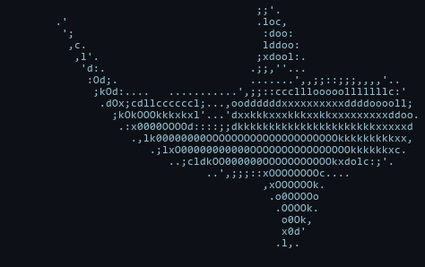

<pre>

⠀⠀⠀⠀⠀⠀⠀⠀⠀⠀⠀⠀⠀⠀⠀⠀⠀⠀⠀⠀⠀⠀⠀⠀⠀⠀⠀⠘⠳⢦⣀⠀⠀⠀⠀⠀⠀⠀⠀⠀⠀⠀⠀⠀⠀⠀⠀⠀⠀⠀⠀⠀⠀⠀⠀⠀⠀⠀
⠀⠀⠀⠀⠀⠀⠀⠀⠀⠀⠀⠀⠀⠀⠀⠀⠀⠀⠀⠀⠀⠀⠀⠀⠀⠀⠀⠀⠀⠀⠙⠻⣦⣀⠀⠀⠀⠀⠀⠀⠀⠀⠀⠀⠀⠀⠀⠀⠀⠀⠀⠀⠀⠀⠀⠀⠀⠀
⠀⠀⠀⠀⠀⠀⠀⠀⠀⠀⠀⠀⠀⠀⠀⠀⠀⠀⠀⠀⠀⠀⠀⠀⠀⠀⠀⠀⠀⠀⠀⠀⠈⢿⣧⡀⣠⣤⡄⠀⠀⠀⠀⠀⠀⠀⠀⠀⠀⠀⠀⠀⠀⠀⠀⠀⠀⠀
⠒⠓⠂⠀⠀⢀⣀⠐⠒⠛⠒⠀⠀⠀⠀⣠⣼⠗⢶⣾⡿⠷⣶⣶⣶⣶⣿⣿⣷⣶⣶⣶⣿⣿⣿⣿⣿⣿⠟⠀⠀⠀⠠⠄⠒⠤⠤⠄⠀⠀⢀⣀⡤⢄⡀⠀⠀⠀
⠀⠀⠀⠐⠉⠉⠀⠉⠁⠀⠀⠀⠀⠠⠞⠛⠋⠙⠛⠻⠿⣿⠿⠿⠿⠿⠿⠿⠛⠛⠿⠿⠿⣿⠿⠿⠿⢷⣶⣤⣤⣤⡤⠴⠾⠖⢂⣀⠤⠴⠦⢄⡀⠀⠀⠀⠀⠀
⠀⠀⠀⠀⠀⠀⠀⠀⠀⠀⠀⠀⠀⠀⠀⠀⠀⠀⠀⠀⠀⠀⠀⠀⠀⠠⠄⠒⠊⠑⠒⠤⠄⠀⠀⠀⠀⠀⠀⠀⠀⠀⠀⠀⠀⠀⠀⠀⠀⠀⠀⠀⠀⠀⠀⠀⠀⠀

⠀⠀⠀⠀⠀⠀⠀⠀⠀⠀⠀ ██████╗██╗  ██╗██╗   ██╗███╗   ███╗⠀⠀⠀⠀⠀⠀⠀⠀⠀⠀⠀
⠀⠀⠀⠀⠀⠀⠀⠀⠀⠀⠀██╔════╝██║  ██║██║   ██║████╗ ████║⠀⠀⠀⠀⠀⠀⠀⠀⠀⠀⠀
⠀⠀⠀⠀⠀⠀⠀⠀⠀⠀⠀██║     ███████║██║   ██║██╔████╔██║⠀⠀⠀⠀⠀⠀⠀⠀⠀⠀⠀
⠀⠀⠀⠀⠀⠀⠀⠀⠀⠀⠀██║     ██╔══██║██║   ██║██║╚██╔╝██║⠀⠀⠀⠀⠀⠀⠀⠀⠀⠀⠀
⠀⠀⠀⠀⠀⠀⠀⠀⠀⠀⠀╚██████╗██║  ██║╚██████╔╝██║ ╚═╝ ██║⠀⠀⠀⠀⠀⠀⠀⠀⠀⠀⠀
⠀⠀⠀⠀⠀⠀⠀⠀⠀⠀⠀ ╚═════╝╚═╝  ╚═╝ ╚═════╝ ╚═╝     ╚═╝⠀⠀⠀⠀⠀⠀⠀⠀⠀⠀⠀

⠀⠀⠀⠀⠀⠀⠀⠀⠀⠀⠀⠀⠀⠀⠀⠀████████╗██╗  ██╗███████╗⠀⠀⠀⠀⠀⠀⠀⠀⠀⠀⠀⠀⠀⠀⠀⠀⠀
⠀⠀⠀⠀⠀⠀⠀⠀⠀⠀⠀⠀⠀⠀⠀⠀╚══██╔══╝██║  ██║██╔════╝⠀⠀⠀⠀⠀⠀⠀⠀⠀⠀⠀⠀⠀⠀⠀⠀⠀
⠀⠀⠀⠀⠀⠀⠀⠀⠀⠀⠀⠀⠀⠀⠀⠀   ██║   ███████║█████╗⠀⠀⠀⠀⠀⠀⠀⠀⠀⠀⠀⠀⠀⠀⠀⠀⠀⠀⠀
⠀⠀⠀⠀⠀⠀⠀⠀⠀⠀⠀⠀⠀⠀⠀⠀   ██║   ██╔══██║██╔══╝⠀⠀⠀⠀⠀⠀⠀⠀⠀⠀⠀⠀⠀⠀⠀⠀⠀⠀⠀
⠀⠀⠀⠀⠀⠀⠀⠀⠀⠀⠀⠀⠀⠀⠀⠀   ██║   ██║  ██║███████╗⠀⠀⠀⠀⠀⠀⠀⠀⠀⠀⠀⠀⠀⠀⠀⠀⠀
⠀⠀⠀⠀⠀⠀⠀⠀⠀⠀⠀⠀⠀⠀⠀⠀   ╚═╝   ╚═╝  ╚═╝╚══════╝⠀⠀⠀⠀⠀⠀⠀⠀⠀⠀⠀⠀⠀⠀⠀⠀⠀

⠀⠀⠀██╗    ██╗ █████╗ ████████╗███████╗██████╗ ███████╗⠀⠀⠀⠀
⠀⠀⠀██║    ██║██╔══██╗╚══██╔══╝██╔════╝██╔══██╗██╔════╝⠀⠀⠀⠀
⠀⠀⠀██║ █╗ ██║███████║   ██║   █████╗  ██████╔╝███████╗⠀⠀⠀⠀
⠀⠀⠀██║███╗██║██╔══██║   ██║   ██╔══╝  ██╔══██╗╚════██║⠀⠀⠀⠀
⠀⠀⠀╚███╔███╔╝██║  ██║   ██║   ███████╗██║  ██║███████║⠀⠀⠀⠀
⠀⠀⠀ ╚══╝╚══╝ ╚═╝  ╚═╝   ╚═╝   ╚══════╝╚═╝  ╚═╝╚══════╝⠀⠀⠀⠀

⠀⠀⠀⠀⠀⠀⠀⠀⠀⠀⠀⠀⠀You're gonna need a bigger boat.⠀⠀⠀⠀⠀⠀⠀⠀⠀⠀⠀⠀⠀

</pre>

  

<h3 align="center">Hi 👋 I'm Brendan Welsh</h3>

<b>aka "<a href="https://chumthewaters.com">chumthewaters</a>"</b>

<i>tinkering since 1991 · vibin' since 2025</i>

  <a href="https://www.linkedin.com/in/brendanwelsh">LinkedIn</a> &nbsp;·&nbsp; <a href="https://x.com/chumthewaters">X</a> &nbsp;·&nbsp; <a href="https://www.strava.com/athletes/164089">Strava</a>

**Tech enthusiast and vibe-coder.** I don't write code; I don't know a single programming language. I direct AI to build the software and make the calls on architecture, taste, and what ships. My strengths are the systems *around* the code: **networking, infrastructure, architecture, and CI/CD**. Deep into smart home, homelab, streaming, audio and video production, gaming, and tech in general.

### Career

Customer-facing, engineering-first. I live on the technical side of the relationship.

- **[Optimizely](https://www.optimizely.com)** · Experimentation engineering for enterprise customers: web + feature experiments, DOM- and SDK-based implementations, wired into their products.
- **[BigPanda](https://www.bigpanda.io)** · Value & Adoption Advisor. Drove technical adoption of the AIOps platform: integrations, event correlation, and monitoring pipelines.
- **[Aqua Security](https://www.aquasec.com)** · Technical Account Manager. Owned enterprise customers' container & Kubernetes security posture: image scanning, runtime protection, and policy.
- **[NEC Biometrics](https://www.nec.com/en/global/solutions/biometrics/index.html)** · Project Implementation Lead for enterprise biometrics & thermal systems at venues like Madison Square Garden, Radio City Music Hall, and Hard Rock Hollywood. Multi-server, GPU-accelerated, Docker-based deployments, everything from physical install to remote support.

### Off the clock

Endurance sport is the obsession: triathlon and cycling on a **[Canyon Aeroad CF SLX 8 Di2](assets/aeroad.png)**, logged on **[Strava](https://www.strava.com/athletes/164089)** with a **Garmin Edge 1050** and **Fenix 8**. Training has me **100+ lbs down**. It's on pause for now while I come back from L5-S1 herniation and spine surgery and rebuild my right side.

Pittsburgh sports to the core (**Steelers, Penguins, Pirates**) plus the **Sacramento Kings** out west, where I built **[Light the Beam](https://lightthebe.am)**. I'm **limited on every major sportsbook** (turns out they don't love a winner), never miss a UFC card, and tinker with home automation, cameras, security, and AI.

### Projects

| Project | What it does | |
| :-- | :-- | :-- |
| **[streamdeck-cameradials](https://github.com/brendanwelsh/streamdeck-cameradials)** | scroll RTSP / UniFi Protect cameras into mpv from a Stream Deck+ dial | |
| **[streamdeck-audioswap](https://github.com/brendanwelsh/streamdeck-audioswap)** | swap the default audio output + master volume from a dial | |
| **[ulanzi-camera-switcher](https://github.com/brendanwelsh/ulanzi-camera-switcher)** | the cameradials idea, reborn on an Ulanzi dial | `WIP` |
| **[ulanzi-synth](https://github.com/brendanwelsh/ulanzi-synth)** | Magic Trackpad + Ulanzi dial as a synth / groovebox | `R&D` |
| **[yasb-wallpaper-engine-color-sync](https://github.com/brendanwelsh/yasb-wallpaper-engine-color-sync)** | tint a YASB bar + taskbar to the active wallpaper | |

### Gamepad viewer skins

| Skin | for gamepadviewer.com | |
| :-- | :-- | :-- |
| **[elite-series-2-white](https://github.com/brendanwelsh/elite-series-2-white)** | Xbox Elite Series 2 (white) | [live »](https://brendanwelsh.github.io/elite-series-2-white/) |
| **[playstation-ds5-white](https://github.com/brendanwelsh/playstation-ds5-white)** | DualSense (white) | [live »](https://brendanwelsh.github.io/playstation-ds5-white/) |

### Sites I've shipped

A few I've vibe-coded and put online:

- **[caltraffic.com](https://caltraffic.com)** · 3,000+ live Caltrans traffic cameras + route planning across California
- **[lightthebe.am](https://lightthebe.am)** · a real-time "did the Sacramento Kings light the beam?" tracker
- **[glizzytime.com](https://glizzytime.com)** · every Nathan's Hot Dog Eating Contest champion since 1972, charted, with a live July 4 countdown
- **[chumthewaters.com](https://chumthewaters.com)** · shark-themed fun page

### Setup

- **Gaming PC** · Ryzen 9 + RTX 5080 · Windows 11
- **MacBook Air** (M1) for the couch, **Mac mini** (M4) that doubles as a webserver
- **Raspberry Pi 4** running Home Assistant + homelab duty
- Triple-monitor desk fronted by a **[Gigabyte M28U](https://www.gigabyte.com/Monitor/M28U)** (4K · 144Hz)

All on a UniFi network. See the [full battlestation evolution, 2006 to today »](https://github.com/brendanwelsh/battlestation-evolution):

### Fav gear

- **[Keychron Q1 HE](https://www.keychron.com/products/keychron-q1-he-qmk-wireless-custom-keyboard)**
- **[Logitech G Pro X Superlight](https://www.logitechg.com/en-us/shop/p/pro-x-superlight-wireless-mouse)** + **[MX Master 3](https://www.logitech.com/en-us/products/mice/mx-master-3.html)**
- **[Apple Magic Trackpad](https://www.apple.com/shop/product/MK2D3AM/A/magic-trackpad)**
- **[DualShock 4](https://www.playstation.com/en-us/accessories/dualshock-4-wireless-controller/)**
- **[Ulanzi D200 dial](https://www.ulanzi.com)** + **[TC001 clock](https://www.ulanzi.com)**
- **[Garmin Fenix 8](https://www.garmin.com/en-US/p/1228429/)**
- **Sony a5100** + **[Elgato Cam Link](https://www.elgato.com/us/en/p/cam-link-4k)** + **[Shure MV7](https://www.shure.com/en-US/products/microphones/mv7)**
- **[CalDigit TS4](https://www.caldigit.com/thunderbolt-station-4/)** + **[Stream Deck XL + Stream Deck+](https://www.elgato.com/us/en/p/stream-deck-xl)**

### Favorite open-source software

- **[Home Assistant](https://www.home-assistant.io)**
- **[OBS Studio](https://obsproject.com)**
- **[mpv](https://mpv.io)**
- **[komorebi](https://github.com/LGUG2Z/komorebi)** + **[whkd](https://github.com/LGUG2Z/whkd)** + **[YASB](https://github.com/amnweb/yasb)**
- **[Docker](https://www.docker.com)** + **[Saltbox](https://docs.saltbox.dev)**
- **[Tailscale](https://tailscale.com)**
- **[PowerToys](https://github.com/microsoft/PowerToys)** + **[VLC](https://www.videolan.org)**

### Music

Everything from Bach to 2Pac. Here's what's been spinning:

### Links

- [LinkedIn](https://linkedin.com/in/brendanwelsh)
- [X / Twitter](https://x.com/chumthewaters)
- [Strava](https://www.strava.com/athletes/164089)
- [brendanw.com](https://brendanw.com)
- [chumthewaters.com](https://chumthewaters.com)

### Stats

<pre>
⠀⠀⠀⠀⠀⠀⠀⠀⠀⠀⠀⠀⠀⠀⠀⠀⠀⠀⠀⠀⠀⠀⠀⠀⠀⠀⠀⠀⠀⣀⣀⡀⠀⠀⠀⠀⠀⠀⠀⠀⠀⠀⠀⠀⠀⠀⠀⠀⠀⠀⠀⠀⠀⠀⠀⠀⠀⠀
⠀⠀⠀⠀⠀⠀⠀⠀⠀⠀⠀⠀⠀⠀⠀⠀⠀⠀⠀⠀⠀⠀⠀⠀⠀⠀⣠⣶⣿⣿⣿⣿⣷⣦⡀⠀⠀⠀⠀⠀⠀⠀⠀⠀⠀⠀⠀⠀⠀⠀⠀⠀⠀⠀⠀⠀⠀⠀
⠀⠀⠀⠀⠀⠀⠀⠀⠀⠀⠀⠀⠀⠀⠀⠀⠀⠀⠀⠀⠀⠀⠀⠀⣴⣿⡿⠛⠉⠀⠀⠉⠻⣿⣿⣦⡄⠀⠀⠀⠀⠀⠀⠀⠀⠀⠀⠀⠀⠀⠀⠀⠀⠀⠀⠀⠀⠀
⠀⠀⠀⠀⠀⠀⠀⠀⠀⠀⠀⠀⠀⠀⠀⠀⠀⠀⠀⠀⠀⠀⣠⣾⣿⠏⠀⠀⠀⠀⠀⠀⠀⠈⠻⣿⣿⣦⡀⠀⠀⠀⠀⠀⠀⠀⠀⠀⠀⠀⠀⠀⠀⠀⠀⠀⠀⠀
⠀⠀⠀⠀⠀⠀⠀⠀⠀⠀⠀⠀⠀⠀⠀⠀⠀⠀⠀⠀⢀⣾⣿⡿⠁⠀⠀⠀⠀⠀⠀⠀⠀⠀⠀⠹⣿⣿⣿⣄⠀⠀⠀⠀⠀⠀⠀⠀⠀⠀⠀⠀⠀⠀⠀⠀⠀⠀
⠀⠀⠀⠀⠀⠀⠀⠀⠀⠀⠀⠀⠀⠀⠀⠀⠀⠀⠀⣰⣿⣿⣿⡁⠀⠀⠀⠀⠀⠀⠀⠀⠀⠀⠀⢸⣿⣿⣿⣿⣧⡀⠀⠀⠀⠀⠀⠀⠀⠀⠀⠀⠀⠀⠀⠀⠀⠀
⠀⠀⠀⠀⠀⠀⠀⠀⠀⠀⠀⠀⠀⠀⠀⠀⠀⢀⣼⣿⣿⡿⣿⠇⠀⠀⠀⠀⠀⠀⠀⠀⠀⠀⠀⠘⠃⠘⣿⣿⣿⣷⡄⠀⠀⠀⠀⠀⠀⠀⠀⠀⠀⠀⠀⠀⠀⠀
⠀⠀⠀⠀⠀⠀⠀⠀⠀⠀⠀⠀⠀⠀⠀⠀⢀⣾⣿⣿⡿⠁⠀⠀⠀⠀⠀⠀⠀⠀⠀⠀⠀⠀⠀⠀⠀⠀⠘⣿⣿⣿⣿⣄⠀⠀⠀⠀⠀⠀⠀⠀⠀⠀⠀⠀⠀⠀
⠀⠀⠀⠀⠀⠀⠀⠀⠀⠀⠀⠀⠀⠀⠀⢠⣾⣿⣿⡿⠁⠀⠀⠀⠀⠀⠀⠀⠀⠀⠀⠀⠀⠀⠀⠀⠀⠀⠀⠈⢿⣿⣿⣿⣆⠀⠀⠀⠀⠀⠀⠀⠀⠀⠀⠀⠀⠀
⠀⠀⠀⠀⠀⠀⠀⠀⠀⠀⠀⠀⠀⠀⢀⣿⣿⣿⡿⠁⠀⠀⠀⠀⠀⠀⠀⠀⠀⠀⠀⠀⠀⠀⠀⠀⠀⠀⠀⠀⠀⠻⢿⣿⣿⣛⣦⡀⠀⠀⠀⠀⠀⠀⠀⠀⠀⠀
⠀⠀⠀⠀⠀⠀⠀⠀⠀⠀⠀⠀⢠⣞⣿⣿⡿⠋⠀⠀⠀⠀⠀⠀⠀⠀⠀⠀⠀⠀⠀⠀⠀⠀⠀⠀⠀⠀⠀⠀⠀⠀⠀⠙⢿⣿⣿⡇⠀⠀⠀⠀⠀⠀⠀⠀⠀⠀
⠀⠀⠀⠀⠀⠀⠀⠀⠀⠀⠀⠀⣿⣿⣿⠋⠀⠀⠀⠀⠀⠀⠀⢀⣀⣀⣀⣤⣴⣾⣶⣤⣤⣄⣀⣀⣀⣀⡀⠀⠀⠀⠀⠀⠀⠙⢿⣧⠀⠀⠀⠀⠀⠀⠀⠀⠀⠀
⠀⠀⠀⠀⠀⠀⠀⠀⠀⠀⠀⢠⣿⡿⠁⠀⠀⠀⣀⣤⣶⣾⣿⣿⣿⣿⣿⡿⠿⠿⣿⠿⠿⠿⣿⣿⣿⣿⣿⣿⣷⣶⣤⡀⠀⠀⠈⢻⣧⠀⠀⠀⠀⠀⠀⠀⠀⠀
⠀⠀⠀⠀⠀⠀⠀⠀⠀⠀⠀⣾⡿⠀⠀⠀⣠⣾⣿⣿⠿⠿⠛⠉⠉⣩⠀⠀⠀⢠⣇⠀⠀⠀⢸⡄⠀⠀⢙⠉⠙⢻⣿⣿⣦⡀⠀⠀⢹⣇⠀⠀⠀⠀⠀⠀⠀⠀
⠀⠀⠀⠀⠀⠀⠀⠀⠀⠀⣸⣿⠁⠀⠀⣼⣿⡿⢟⠁⠀⢠⡄⠀⠀⣿⣧⠀⢀⣿⣿⡄⠀⢠⣿⣇⠀⢠⣿⠀⠀⢰⠉⠙⣿⣷⡀⠀⠀⢿⡆⠀⠀⠀⠀⠀⠀⠀
⠀⠀⠀⠀⠀⠀⠀⠀⠀⢰⣿⡇⠀⠀⣸⣿⠏⠀⢸⣄⠀⢸⣿⣦⣸⣿⣿⣧⣸⣿⣿⣇⣠⣿⣿⣿⢠⣿⣿⠀⣠⣿⠀⠀⡼⣿⣇⠀⠀⠸⣿⡄⠀⠀⠀⠀⠀⠀
⠀⠀⠀⠀⠀⠀⠀⠀⢀⣿⣿⠁⠀⠀⣿⢿⡀⠀⢸⣿⣷⣬⣿⣿⣿⣿⣿⣿⣿⣿⣿⣿⣿⣿⣿⣿⣿⣿⣿⣾⣿⣿⠀⣴⡇⢸⣿⠀⠀⠀⣿⣿⡀⠀⠀⠀⠀⠀
⠀⠀⠀⠀⠀⠀⠀⠀⣾⣿⣿⠀⠀⢸⡟⠈⣿⣦⣼⣿⣿⣿⣿⣿⣿⣿⣿⣿⣿⣿⣿⣿⣿⣿⣿⣿⣿⣿⣿⣿⣿⣿⣾⣿⠃⡜⢹⠀⠀⠀⣿⣿⣷⠀⠀⠀⠀⠀
⠀⠀⠀⠀⠀⠀⠀⣼⣿⣿⡟⠀⠀⢸⡿⣄⣿⣿⣿⣿⣿⣿⣿⣿⣿⣿⣿⣿⣿⣿⣿⣿⣿⣿⣿⣿⣿⣿⣿⣿⣿⣿⣿⣿⣿⠃⣸⠀⠀⠀⣿⣿⣿⣧⠀⠀⠀⠀
⠀⠀⠀⠀⠀⠀⣰⣿⣿⣿⡇⠀⠀⢸⠀⣿⣿⣿⣿⣿⣿⣿⣿⣿⣿⣿⣿⣿⣿⣿⣿⣿⣿⣿⣿⣿⣿⣿⣿⣿⣿⣿⣿⣿⣿⣾⡿⠀⠀⠀⣿⣿⣿⣿⡆⠀⠀⠀
⠀⠀⠀⠀⠀⢠⣿⣿⣿⣿⠀⠀⠀⠀⣷⣿⣿⣿⣿⣿⣿⣿⣿⣿⣿⣿⣿⣿⣿⣿⣿⣿⣿⣿⣿⣿⣿⣿⣿⣿⣿⣿⣿⣿⣿⣿⡇⠀⠀⠀⣿⣿⣿⣿⣿⡀⠀⠀
⠀⠀⠀⠀⠀⣾⣿⣿⣿⡇⠀⠀⠀⠀⢹⣿⣿⣿⣿⣿⣿⣿⡿⢿⣿⣿⣿⠋⠸⣿⣿⣿⡟⠈⢻⣿⣿⡟⠻⣿⣿⣿⣿⣿⣿⡿⠀⠀⠀⠀⣿⣿⣿⣿⣿⣇⠀⠀
⠀⠀⠀⠀⢰⣿⣿⣿⡟⠀⠀⠀⠀⠀⠀⣿⣿⣿⣿⣿⣿⣿⠃⠀⢻⣿⠇⠀⠀⢻⣿⣿⠃⠀⠀⢿⡿⠁⠀⢻⣿⣿⣿⣿⣿⣷⠀⠀⠀⠀⠸⣿⣿⣿⣿⣿⡀⠀
⠀⠀⠀⠀⣾⣿⣿⣿⠃⠀⠀⠀⠀⠀⠀⣿⣿⣿⢿⣿⠙⢿⠀⠀⠀⠙⠀⠀⣀⣀⣻⣁⣀⠀⠀⠘⠁⠀⠀⠸⠋⣿⡿⣿⣿⣿⠀⠀⠀⠀⠀⠹⣿⣿⣿⣿⡇⠀
⠀⠀⠀⠀⣿⣿⣿⡇⠀⠀⠀⠀⠀⠀⠀⠘⣏⠛⠀⠹⢀⣀⣠⣤⣴⠶⠿⠟⠛⠋⠉⠉⠛⠛⠻⠶⠦⣤⣄⣀⣀⣉⣀⣋⣸⠏⠀⠀⠀⠀⠀⠀⠙⣿⣿⣿⣿⠀
⠀⠀⠀⢰⣿⣿⡿⠀⠀⠀⠀⠀⠀⠀⠀⠀⠀⠉⠉⠉⠉⠉⠉⠀⠀⠀⠀⠀⠀⠀⠀⠀⠀⠀⠀⠀⠀⠀⠀⠉⠉⠉⠉⠁⠀⠀⠀⠀⠀⠀⠀⠀⠀⠹⣿⣿⣿⡄
⠀⠀⠀⢸⣿⣿⡇⠀⠀⠀⠀⠀⠀⠀⠀⠀⠀⠀⠀⠀⠀⠀⠀⠀⠀⠀⠀⠀⠀⠀⠀⠀⠀⠀⠀⠀⠀⠀⠀⠀⠀⠀⠀⠀⠀⠀⠀⠀⠀⠀⠀⠀⠀⠀⢻⣿⣿⡇
⠀⠀⠀⢸⣿⣿⡇⠀⠀⠀⠀⠀⠀⠀⠀⠀⠀⠀⠀⠀⠀⠀⠀⠀⠀⠀⠀⠀⠀⠀⠀⠀⠀⠀⠀⠀⠀⠀⠀⠀⠀⠀⠀⠀⠀⠀⠀⠀⠀⠀⠀⠀⠀⠀⢸⣿⣿⡇
⠀⠀⠀⠘⣿⣿⣇⠀⠀⠀⠀⠀⠀⠀⠀⠀⠀⠀⠀⠀⠀⠀⠀⠀⠀⠀⠀⣀⣀⣀⣀⣀⣀⠀⠀⠀⠀⠀⠀⠀⠀⠀⠀⠀⠀⠀⠀⠀⠀⠀⠀⠀⠀⠀⢸⣿⣿⠁
⠀⠀⠀⠀⠈⠻⣿⡆⠀⠀⠀⠀⠀⠀⠀⠀⠀⠀⠀⠀⠀⠀⠀⠀⠀⠐⠋⠉⠁⠀⠀⠀⠉⠉⠂⠀⠀⠀⠀⠀⠀⠀⠀⠀⠀⠀⠀⠀⠀⠀⠀⠀⠀⠀⢸⡿⠃⠀
⠀⠀⠀⠀⠀⠀⠈⠻⠄⠀⠀⠀⠀⠀⠀⠀⠀⠀⠀⠀⠀⠀⠀⠀⠀⠀⠀⠀⠀⠀⠀⠀⠀⠀⠀⠀⠀⠀⠀⠀⠀⠀⠀⠀⠀⠀⠀⠀⠀⠀⠀⠀⠀⠀⠘⠁⠀⠀
</pre>

<em>This was no boat accident.</em>

