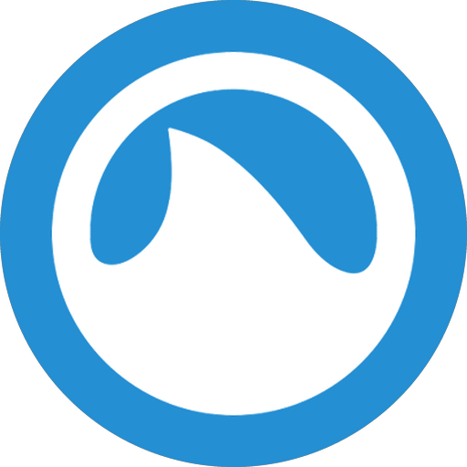
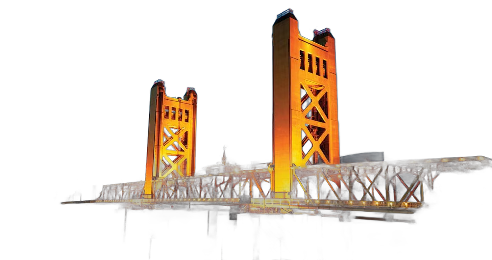
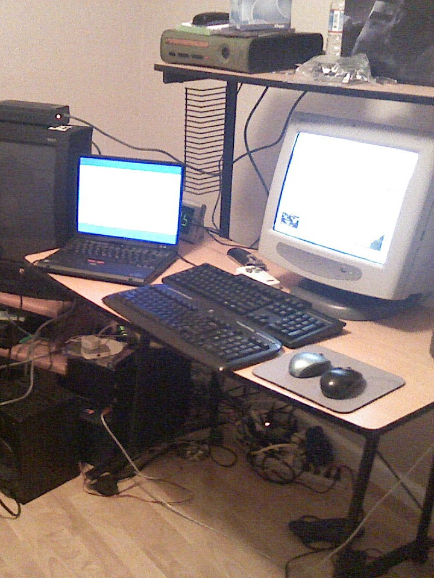
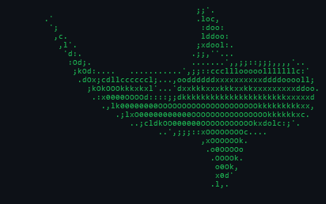

<pre>
⠀⠀⠀⠀⠀⠀⠀⠀⠀⠀⠀⠀⠀⠀⠀⠀⠀⠀⠀⠀⠀⠀⠀⠀⠘⠳⢦⣀⠀⠀⠀⠀⠀⠀⠀⠀⠀⠀⠀⠀⠀⠀⠀⠀⠀⠀⠀⠀⠀⠀⠀
⠀⠀⠀⠀⠀⠀⠀⠀⠀⠀⠀⠀⠀⠀⠀⠀⠀⠀⠀⠀⠀⠀⠀⠀⠀⠀⠀⠙⠻⣦⣀⠀⠀⠀⠀⠀⠀⠀⠀⠀⠀⠀⠀⠀⠀⠀⠀⠀⠀⠀⠀
⠀⠀⠀⠀⠀⠀⠀⠀⠀⠀⠀⠀⠀⠀⠀⠀⠀⠀⠀⠀⠀⠀⠀⠀⠀⠀⠀⠀⠀⠈⢿⣧⡀⣠⣤⡄⠀⠀⠀⠀⠀⠀⠀⠀⠀⠀⠀⠀⠀⠀⠀
⠀⠀⠀⠀⠀⠀⠀⠀⠀⠀⠀⠀⣠⣼⠗⢶⣾⡿⠷⣶⣶⣶⣶⣿⣿⣷⣶⣶⣶⣿⣿⣿⣿⣿⣿⠟⠀⠀⠀⠠⠄⠀⠀⠀⠀⠀⠀⠀⠀⠀⠀
⠀⠀⠀⠀⠀⠀⠀⠀⠀⠀⠠⠞⠛⠋⠙⠛⠻⠿⣿⠿⠿⠿⠿⠿⠿⠛⠛⠿⠿⠿⣿⠿⠿⠿⢷⣶⣤⣤⣤⡤⠴⠀⠀⠀⠀⠀⠀⠀⠀⠀⠀
⠀⠀⠀⠀⠀⠀⠀⠀⠀⠀⠀⠀⠀⠀⠀⠀⠀⠀⠀⠀⠀⠀⠠⠄⠒⠊⠑⠒⠤⠄⠀⠀⠀⠀⠀⠀⠀⠀⠀⠀⠀⠀⠀⠀⠀⠀⠀⠀⠀⠀⠀

⠀⠀⠀⠀⠀⠀⠀ ██████╗██╗  ██╗██╗   ██╗███╗   ███╗⠀⠀⠀⠀⠀⠀⠀⠀
⠀⠀⠀⠀⠀⠀⠀██╔════╝██║  ██║██║   ██║████╗ ████║⠀⠀⠀⠀⠀⠀⠀⠀
⠀⠀⠀⠀⠀⠀⠀██║     ███████║██║   ██║██╔████╔██║⠀⠀⠀⠀⠀⠀⠀⠀
⠀⠀⠀⠀⠀⠀⠀██║     ██╔══██║██║   ██║██║╚██╔╝██║⠀⠀⠀⠀⠀⠀⠀⠀
⠀⠀⠀⠀⠀⠀⠀╚██████╗██║  ██║╚██████╔╝██║ ╚═╝ ██║⠀⠀⠀⠀⠀⠀⠀⠀
⠀⠀⠀⠀⠀⠀⠀ ╚═════╝╚═╝  ╚═╝ ╚═════╝ ╚═╝     ╚═╝⠀⠀⠀⠀⠀⠀⠀⠀

⠀⠀⠀⠀⠀⠀⠀⠀⠀⠀⠀⠀⠀████████╗██╗  ██╗███████╗⠀⠀⠀⠀⠀⠀⠀⠀⠀⠀⠀⠀⠀
⠀⠀⠀⠀⠀⠀⠀⠀⠀⠀⠀⠀⠀╚══██╔══╝██║  ██║██╔════╝⠀⠀⠀⠀⠀⠀⠀⠀⠀⠀⠀⠀⠀
⠀⠀⠀⠀⠀⠀⠀⠀⠀⠀⠀⠀⠀   ██║   ███████║█████╗⠀⠀⠀⠀⠀⠀⠀⠀⠀⠀⠀⠀⠀⠀⠀
⠀⠀⠀⠀⠀⠀⠀⠀⠀⠀⠀⠀⠀   ██║   ██╔══██║██╔══╝⠀⠀⠀⠀⠀⠀⠀⠀⠀⠀⠀⠀⠀⠀⠀
⠀⠀⠀⠀⠀⠀⠀⠀⠀⠀⠀⠀⠀   ██║   ██║  ██║███████╗⠀⠀⠀⠀⠀⠀⠀⠀⠀⠀⠀⠀⠀
⠀⠀⠀⠀⠀⠀⠀⠀⠀⠀⠀⠀⠀   ╚═╝   ╚═╝  ╚═╝╚══════╝⠀⠀⠀⠀⠀⠀⠀⠀⠀⠀⠀⠀⠀

██╗    ██╗ █████╗ ████████╗███████╗██████╗ ███████╗
██║    ██║██╔══██╗╚══██╔══╝██╔════╝██╔══██╗██╔════╝
██║ █╗ ██║███████║   ██║   █████╗  ██████╔╝███████╗
██║███╗██║██╔══██║   ██║   ██╔══╝  ██╔══██╗╚════██║
╚███╔███╔╝██║  ██║   ██║   ███████╗██║  ██║███████║
 ╚══╝╚══╝ ╚═╝  ╚═╝   ╚═╝   ╚══════╝╚═╝  ╚═╝╚══════╝

⠀⠀⠀⠀⠀⠀⠀⠀⠀You're gonna need a bigger boat.⠀⠀⠀⠀⠀⠀⠀⠀⠀⠀
</pre>

  

<h3 align="center">Hi 👋 I'm Brendan Welsh</h3>

<b>aka "<a href="https://chumthewaters.com">chumthewaters</a>"</b>

<i>tinkering since 1991 · vibin' since 2025</i>

  <a href="https://www.linkedin.com/in/brendanwelsh">LinkedIn</a> &nbsp;·&nbsp;
  <a href="https://x.com/chumthewaters">X</a> &nbsp;·&nbsp;
  <a href="https://www.strava.com/athletes/164089">Strava</a> &nbsp;·&nbsp;
  <a href="https://open.spotify.com/user/brendanwelsh">Spotify</a> &nbsp;·&nbsp;
  <a href="https://steamcommunity.com/id/chumthewaters">Steam</a> &nbsp;·&nbsp;
  <a href="https://www.twitch.tv/chumthewaters">Twitch</a>

  
  &nbsp;
  

**Based in Sacramento, California.** Tech enthusiast and vibe-coder — I don't write code; I don't know a single programming language. I direct **Claude** and **Codex** to build the software and make the calls on architecture, taste, and what ships. My strengths are the systems *around* the code: **networking, infrastructure, architecture, and CI/CD**. Deep into smart home, homelab, streaming, audio and video production, and tech in general.

### Sacramento grown

Folsom-raised, with computers always around — a **Nintendo kid** with a **SNES** and **GameCube** never far from reach, weaned on MS-DOS classics like **[Stunts](https://github.com/4d-stunts/restunts)**, **[The Incredible Machine](https://github.com/ebonnal/the-new-incredible-machine)**, and **[Lemmings](https://github.com/tomsoftware/Lemmings.ts)** — my dad kept the commands to launch Stunts on a sheet of paper taped next to the kitchen computer. Knee-deep in PCs and desktop customization ever since. Always a gamer — from a [2004 GameFAQs review of Ninja Gaiden](https://gamefaqs.gamespot.com/nes/587488-ninja-gaiden/reviews/70305) to mostly **Rocket League** these days.

  

### Career

Customer-facing, engineering-first. I live on the technical side of the relationship.

- **[Optimizely](https://www.optimizely.com)** · Experimentation engineering for enterprise customers: web + feature experiments, DOM- and SDK-based implementations, wired into their products.
- **[BigPanda](https://www.bigpanda.io)** · Value & Adoption Advisor. Drove technical adoption of the AIOps platform: integrations, event correlation, and monitoring pipelines.
- **[Aqua Security](https://www.aquasec.com)** · Technical Account Manager. Aqua is literally Enterprise **[Trivy](https://github.com/aquasecurity/trivy)** (Trivy is their open-source scanner) — I helped enterprise customers across verticals — Amazon, Tesla, American Airlines, Union Pacific, Philips, Emerson Electric, Las Vegas Metro PD — drive their container & Kubernetes security posture: image scanning, runtime protection, and policy.
- **[NEC Biometrics](https://www.nec.com/en/global/solutions/biometrics/index.html)** · Project Implementation Lead for enterprise biometrics & thermal systems at venues like Madison Square Garden, Radio City Music Hall, and Hard Rock Hollywood. Multi-server, GPU-accelerated, Docker-based deployments, everything from physical install to remote support.

### Off the clock

Endurance sport is the obsession: triathlon and cycling on a **[Canyon Aeroad CF SLX 8 Di2](assets/aeroad.png)**, logged on **[Strava](https://www.strava.com/athletes/164089)** with a **Garmin Edge 1050** and **Fenix 8**. Training has me **100+ lbs down**, and these days I lift on a **[4-day PHUL split](https://www.muscleandstrength.com/workouts/phul-workout)**.

I bleed black and yellow with a side of purple — Pittsburgh sports to the core (**Steelers, Penguins, Pirates**) plus the **Sacramento Kings** out west, where I built **[Light the Beam](https://lightthebe.am)**. I'm **limited on every major sportsbook** (turns out they don't love a winner), never miss a UFC card, and tinker with home automation, cameras, security, and AI.

  

### Projects

**Rocket League**

| Project | What it does |
| :-- | :-- |
| **[ballshark](https://github.com/brendanwelsh/ballshark)** | self-hosted RL stats tracker — local Stats API → SQLite + Discord embeds + dashboard + OBS overlay, no third-party services |
| **[clocket-league](https://github.com/brendanwelsh/clocket-league)** | live RL scoreboard on an AWTRIX pixel clock (Ulanzi TC001), reading the local Stats API — no cloud |

**Stream Deck+ plugins**

| Project | What it does |
| :-- | :-- |
| **[streamdeck-cameradials](https://github.com/brendanwelsh/streamdeck-cameradials)** | scroll RTSP / UniFi Protect cameras into mpv from a Stream Deck+ dial |
| **[streamdeck-audioswap](https://github.com/brendanwelsh/streamdeck-audioswap)** | swap the default audio output + master volume from a Stream Deck+ dial |

**Ulanzi**

| Project | What it does |
| :-- | :-- |
| **[ulanzi-d100h-homebrew](https://github.com/brendanwelsh/ulanzi-d100h-homebrew)** | reverse-engineering notes for the Ulanzi D100H dial |
| **[ulanzi-camera-switcher](https://github.com/brendanwelsh/ulanzi-camera-switcher)** | the cameradials idea, reborn on an Ulanzi dial |
| **[chumthesizer](https://github.com/brendanwelsh/chumthesizer)** | Magic Trackpad + Ulanzi dial as a synth / groovebox |
| **[ulanzi-pixel-clock-awtrix](https://github.com/brendanwelsh/ulanzi-pixel-clock-awtrix)** | guide + resources for the Ulanzi TC001 pixel clock and AWTRIX firmware |

**Desktop**

| Project | What it does |
| :-- | :-- |
| **[yasb-wallpaper-engine-color-sync](https://github.com/brendanwelsh/yasb-wallpaper-engine-color-sync)** | tint the YASB bar + Windows taskbar to the active Wallpaper Engine wallpaper |

**Curated lists**

| List | What it is |
| :-- | :-- |
| **[awesome-komorebi](https://github.com/brendanwelsh/awesome-komorebi)** | a curated list of komorebi (Windows tiling WM) resources |
| **[awesome-stream-deck](https://github.com/brendanwelsh/awesome-stream-deck)** | a curated list of Elgato Stream Deck plugins, tools, and resources |
| **[awesome-wallpaper-engine](https://github.com/brendanwelsh/awesome-wallpaper-engine)** | a curated list of Wallpaper Engine tools and integrations |

### Gamepad viewer skins

| Skin | For gamepadviewer.com | |
| :-- | :-- | :-- |
| **[elite-series-2-white](https://github.com/brendanwelsh/elite-series-2-white)** | Xbox Elite Series 2 (white) | [live »](https://brendanwelsh.github.io/elite-series-2-white/) |
| **[playstation-ds5-white](https://github.com/brendanwelsh/playstation-ds5-white)** | DualSense (white) | [live »](https://brendanwelsh.github.io/playstation-ds5-white/) |

### Sites I've shipped

| Site | What it is |
| :-- | :-- |
| **[caltraffic.com](https://caltraffic.com)** | 3,000+ live Caltrans traffic cameras + route planning across California |
| **[lightthebe.am](https://lightthebe.am)** | a real-time "did the Sacramento Kings light the beam?" tracker |
| **[glizzytime.com](https://glizzytime.com)** | every Nathan's Hot Dog Eating Contest champion since 1972, charted, with a live July 4 countdown |
| **[chumthewaters.com](https://chumthewaters.com)** | shark-themed fun page |
| **[brendanw.com](https://brendanw.com)** | personal site |

### Battlestation

My happy place — multiple displays, too many dials, and a self-hosted homelab humming away in the background. Over-engineered and wired together in a way that probably shouldn't run as well as it does.

  
  &nbsp;
  

<b>The evolution, 2007 → present</b> &nbsp;·&nbsp; <a href="https://github.com/brendanwelsh/battlestation-evolution">full-size gallery »</a>

<table align="center">
<tr>
<td valign="top" width="50%">

### Fav gear

- **[Keychron Q1 HE](https://www.keychron.com/products/keychron-q1-he-qmk-wireless-custom-keyboard)**
- **[Logitech G Pro X Superlight](https://www.logitechg.com/en-us/shop/p/pro-x-superlight-wireless-mouse)**
- **[MX Master 3](https://www.logitech.com/en-us/products/mice/mx-master-3.html)**
- **[Apple Magic Trackpad](https://www.apple.com/shop/product/MK2D3AM/A/magic-trackpad)**
- **[DualShock 4](https://www.playstation.com/en-us/accessories/dualshock-4-wireless-controller/)**
- **[Sony a5100](https://www.dpreview.com/products/sony/slrs/sony_a5100)**
- **[Elgato Cam Link](https://www.elgato.com/us/en/p/cam-link-4k)**
- **[Shure MV7](https://www.shure.com/en-US/products/microphones/mv7)**
- **[Elgato Key Light Mini](https://www.elgato.com/us/en/p/key-light-mini)**
- **[CalDigit TS4](https://www.caldigit.com/thunderbolt-station-4/)**
- **[Stream Deck XL](https://www.elgato.com/us/en/p/stream-deck-xl)**
- **[Stream Deck+](https://www.elgato.com/us/en/p/stream-deck-plus)**
- **[Ulanzi D100H dial](https://www.ulanzi.com/products/d100h-dial-creative-controller-i003)**
- **[Ulanzi TC001 clock](https://www.ulanzi.com/products/ulanzi-pixel-smart-clock-2882)**
- **[Garmin Fenix 8](https://www.garmin.com/en-US/p/1228429/)**

</td>
<td valign="top" width="50%">

### Favorite software

- **[Home Assistant](https://www.home-assistant.io)**
- **[Proxmox VE](https://www.proxmox.com)** + **[Docker](https://www.docker.com)**
- **[Saltbox](https://docs.saltbox.dev)** + **[Sonarr](https://sonarr.tv)** / **[Radarr](https://radarr.video)** / **[Prowlarr](https://prowlarr.com)**
- **[komorebi](https://github.com/LGUG2Z/komorebi)** + **[whkd](https://github.com/LGUG2Z/whkd)** + **[YASB](https://github.com/amnweb/yasb)**
- **[Wallpaper Engine](https://store.steampowered.com/app/431960/Wallpaper_Engine/)**
- **[OBS Studio](https://obsproject.com)**
- **[Spotify](https://www.spotify.com)**
- **[Tailscale](https://tailscale.com)**
- **[AWTRIX](https://github.com/Blueforcer/awtrix3)**
- **[MacroFactor](https://macrofactorapp.com)**

</td>
</tr>
</table>

### Music

Everything from Bach to 2Pac, basically. Here's what's been spinning lately:

  
  &nbsp;&nbsp;
  

<em>"Don't ever forget that you were once a child full of wonder, before the world taught you how to be afraid."</em> —&nbsp;Slug, Atmosphere

<pre>
⠀⠀⠀⠀⠀⠀⠀⠀⠀⠀⠀⠀⠀⠀⠀⠀⠀⠀⠀⠀⠀⠀⠀⠀⠀⠀⠀⠀⠀⣀⣀⡀⠀⠀⠀⠀⠀⠀⠀⠀⠀⠀⠀⠀⠀⠀⠀⠀⠀⠀⠀⠀⠀⠀⠀⠀⠀⠀
⠀⠀⠀⠀⠀⠀⠀⠀⠀⠀⠀⠀⠀⠀⠀⠀⠀⠀⠀⠀⠀⠀⠀⠀⠀⠀⣠⣶⣿⣿⣿⣿⣷⣦⡀⠀⠀⠀⠀⠀⠀⠀⠀⠀⠀⠀⠀⠀⠀⠀⠀⠀⠀⠀⠀⠀⠀⠀
⠀⠀⠀⠀⠀⠀⠀⠀⠀⠀⠀⠀⠀⠀⠀⠀⠀⠀⠀⠀⠀⠀⠀⠀⣴⣿⡿⠛⠉⠀⠀⠉⠻⣿⣿⣦⡄⠀⠀⠀⠀⠀⠀⠀⠀⠀⠀⠀⠀⠀⠀⠀⠀⠀⠀⠀⠀⠀
⠀⠀⠀⠀⠀⠀⠀⠀⠀⠀⠀⠀⠀⠀⠀⠀⠀⠀⠀⠀⠀⠀⣠⣾⣿⠏⠀⠀⠀⠀⠀⠀⠀⠈⠻⣿⣿⣦⡀⠀⠀⠀⠀⠀⠀⠀⠀⠀⠀⠀⠀⠀⠀⠀⠀⠀⠀⠀
⠀⠀⠀⠀⠀⠀⠀⠀⠀⠀⠀⠀⠀⠀⠀⠀⠀⠀⠀⠀⢀⣾⣿⡿⠁⠀⠀⠀⠀⠀⠀⠀⠀⠀⠀⠹⣿⣿⣿⣄⠀⠀⠀⠀⠀⠀⠀⠀⠀⠀⠀⠀⠀⠀⠀⠀⠀⠀
⠀⠀⠀⠀⠀⠀⠀⠀⠀⠀⠀⠀⠀⠀⠀⠀⠀⠀⠀⣰⣿⣿⣿⡁⠀⠀⠀⠀⠀⠀⠀⠀⠀⠀⠀⢸⣿⣿⣿⣿⣧⡀⠀⠀⠀⠀⠀⠀⠀⠀⠀⠀⠀⠀⠀⠀⠀⠀
⠀⠀⠀⠀⠀⠀⠀⠀⠀⠀⠀⠀⠀⠀⠀⠀⠀⢀⣼⣿⣿⡿⣿⠇⠀⠀⠀⠀⠀⠀⠀⠀⠀⠀⠀⠘⠃⠘⣿⣿⣿⣷⡄⠀⠀⠀⠀⠀⠀⠀⠀⠀⠀⠀⠀⠀⠀⠀
⠀⠀⠀⠀⠀⠀⠀⠀⠀⠀⠀⠀⠀⠀⠀⠀⢀⣾⣿⣿⡿⠁⠀⠀⠀⠀⠀⠀⠀⠀⠀⠀⠀⠀⠀⠀⠀⠀⠘⣿⣿⣿⣿⣄⠀⠀⠀⠀⠀⠀⠀⠀⠀⠀⠀⠀⠀⠀
⠀⠀⠀⠀⠀⠀⠀⠀⠀⠀⠀⠀⠀⠀⠀⢠⣾⣿⣿⡿⠁⠀⠀⠀⠀⠀⠀⠀⠀⠀⠀⠀⠀⠀⠀⠀⠀⠀⠀⠈⢿⣿⣿⣿⣆⠀⠀⠀⠀⠀⠀⠀⠀⠀⠀⠀⠀⠀
⠀⠀⠀⠀⠀⠀⠀⠀⠀⠀⠀⠀⠀⠀⢀⣿⣿⣿⡿⠁⠀⠀⠀⠀⠀⠀⠀⠀⠀⠀⠀⠀⠀⠀⠀⠀⠀⠀⠀⠀⠀⠻⢿⣿⣿⣛⣦⡀⠀⠀⠀⠀⠀⠀⠀⠀⠀⠀
⠀⠀⠀⠀⠀⠀⠀⠀⠀⠀⠀⠀⢠⣞⣿⣿⡿⠋⠀⠀⠀⠀⠀⠀⠀⠀⠀⠀⠀⠀⠀⠀⠀⠀⠀⠀⠀⠀⠀⠀⠀⠀⠀⠙⢿⣿⣿⡇⠀⠀⠀⠀⠀⠀⠀⠀⠀⠀
⠀⠀⠀⠀⠀⠀⠀⠀⠀⠀⠀⠀⣿⣿⣿⠋⠀⠀⠀⠀⠀⠀⠀⢀⣀⣀⣀⣤⣴⣾⣶⣤⣤⣄⣀⣀⣀⣀⡀⠀⠀⠀⠀⠀⠀⠙⢿⣧⠀⠀⠀⠀⠀⠀⠀⠀⠀⠀
⠀⠀⠀⠀⠀⠀⠀⠀⠀⠀⠀⢠⣿⡿⠁⠀⠀⠀⣀⣤⣶⣾⣿⣿⣿⣿⣿⡿⠿⠿⣿⠿⠿⠿⣿⣿⣿⣿⣿⣿⣷⣶⣤⡀⠀⠀⠈⢻⣧⠀⠀⠀⠀⠀⠀⠀⠀⠀
⠀⠀⠀⠀⠀⠀⠀⠀⠀⠀⠀⣾⡿⠀⠀⠀⣠⣾⣿⣿⠿⠿⠛⠉⠉⣩⠀⠀⠀⢠⣇⠀⠀⠀⢸⡄⠀⠀⢙⠉⠙⢻⣿⣿⣦⡀⠀⠀⢹⣇⠀⠀⠀⠀⠀⠀⠀⠀
⠀⠀⠀⠀⠀⠀⠀⠀⠀⠀⣸⣿⠁⠀⠀⣼⣿⡿⢟⠁⠀⢠⡄⠀⠀⣿⣧⠀⢀⣿⣿⡄⠀⢠⣿⣇⠀⢠⣿⠀⠀⢰⠉⠙⣿⣷⡀⠀⠀⢿⡆⠀⠀⠀⠀⠀⠀⠀
⠀⠀⠀⠀⠀⠀⠀⠀⠀⢰⣿⡇⠀⠀⣸⣿⠏⠀⢸⣄⠀⢸⣿⣦⣸⣿⣿⣧⣸⣿⣿⣇⣠⣿⣿⣿⢠⣿⣿⠀⣠⣿⠀⠀⡼⣿⣇⠀⠀⠸⣿⡄⠀⠀⠀⠀⠀⠀
⠀⠀⠀⠀⠀⠀⠀⠀⢀⣿⣿⠁⠀⠀⣿⢿⡀⠀⢸⣿⣷⣬⣿⣿⣿⣿⣿⣿⣿⣿⣿⣿⣿⣿⣿⣿⣿⣿⣿⣾⣿⣿⠀⣴⡇⢸⣿⠀⠀⠀⣿⣿⡀⠀⠀⠀⠀⠀
⠀⠀⠀⠀⠀⠀⠀⠀⣾⣿⣿⠀⠀⢸⡟⠈⣿⣦⣼⣿⣿⣿⣿⣿⣿⣿⣿⣿⣿⣿⣿⣿⣿⣿⣿⣿⣿⣿⣿⣿⣿⣿⣾⣿⠃⡜⢹⠀⠀⠀⣿⣿⣷⠀⠀⠀⠀⠀
⠀⠀⠀⠀⠀⠀⠀⣼⣿⣿⡟⠀⠀⢸⡿⣄⣿⣿⣿⣿⣿⣿⣿⣿⣿⣿⣿⣿⣿⣿⣿⣿⣿⣿⣿⣿⣿⣿⣿⣿⣿⣿⣿⣿⣿⠃⣸⠀⠀⠀⣿⣿⣿⣧⠀⠀⠀⠀
⠀⠀⠀⠀⠀⠀⣰⣿⣿⣿⡇⠀⠀⢸⠀⣿⣿⣿⣿⣿⣿⣿⣿⣿⣿⣿⣿⣿⣿⣿⣿⣿⣿⣿⣿⣿⣿⣿⣿⣿⣿⣿⣿⣿⣿⣾⡿⠀⠀⠀⣿⣿⣿⣿⡆⠀⠀⠀
⠀⠀⠀⠀⠀⢠⣿⣿⣿⣿⠀⠀⠀⠀⣷⣿⣿⣿⣿⣿⣿⣿⣿⣿⣿⣿⣿⣿⣿⣿⣿⣿⣿⣿⣿⣿⣿⣿⣿⣿⣿⣿⣿⣿⣿⣿⡇⠀⠀⠀⣿⣿⣿⣿⣿⡀⠀⠀
⠀⠀⠀⠀⠀⣾⣿⣿⣿⡇⠀⠀⠀⠀⢹⣿⣿⣿⣿⣿⣿⣿⡿⢿⣿⣿⣿⠋⠸⣿⣿⣿⡟⠈⢻⣿⣿⡟⠻⣿⣿⣿⣿⣿⣿⡿⠀⠀⠀⠀⣿⣿⣿⣿⣿⣇⠀⠀
⠀⠀⠀⠀⢰⣿⣿⣿⡟⠀⠀⠀⠀⠀⠀⣿⣿⣿⣿⣿⣿⣿⠃⠀⢻⣿⠇⠀⠀⢻⣿⣿⠃⠀⠀⢿⡿⠁⠀⢻⣿⣿⣿⣿⣿⣷⠀⠀⠀⠀⠸⣿⣿⣿⣿⣿⡀⠀
⠀⠀⠀⠀⣾⣿⣿⣿⠃⠀⠀⠀⠀⠀⠀⣿⣿⣿⢿⣿⠙⢿⠀⠀⠀⠙⠀⠀⣀⣀⣻⣁⣀⠀⠀⠘⠁⠀⠀⠸⠋⣿⡿⣿⣿⣿⠀⠀⠀⠀⠀⠹⣿⣿⣿⣿⡇⠀
⠀⠀⠀⠀⣿⣿⣿⡇⠀⠀⠀⠀⠀⠀⠀⠘⣏⠛⠀⠹⢀⣀⣠⣤⣴⠶⠿⠟⠛⠋⠉⠉⠛⠛⠻⠶⠦⣤⣄⣀⣀⣉⣀⣋⣸⠏⠀⠀⠀⠀⠀⠀⠙⣿⣿⣿⣿⠀
⠀⠀⠀⢰⣿⣿⡿⠀⠀⠀⠀⠀⠀⠀⠀⠀⠀⠉⠉⠉⠉⠉⠉⠀⠀⠀⠀⠀⠀⠀⠀⠀⠀⠀⠀⠀⠀⠀⠀⠉⠉⠉⠉⠁⠀⠀⠀⠀⠀⠀⠀⠀⠀⠹⣿⣿⣿⡄
⠀⠀⠀⢸⣿⣿⡇⠀⠀⠀⠀⠀⠀⠀⠀⠀⠀⠀⠀⠀⠀⠀⠀⠀⠀⠀⠀⠀⠀⠀⠀⠀⠀⠀⠀⠀⠀⠀⠀⠀⠀⠀⠀⠀⠀⠀⠀⠀⠀⠀⠀⠀⠀⠀⢻⣿⣿⡇
⠀⠀⠀⢸⣿⣿⡇⠀⠀⠀⠀⠀⠀⠀⠀⠀⠀⠀⠀⠀⠀⠀⠀⠀⠀⠀⠀⠀⠀⠀⠀⠀⠀⠀⠀⠀⠀⠀⠀⠀⠀⠀⠀⠀⠀⠀⠀⠀⠀⠀⠀⠀⠀⠀⢸⣿⣿⡇
⠀⠀⠀⠘⣿⣿⣇⠀⠀⠀⠀⠀⠀⠀⠀⠀⠀⠀⠀⠀⠀⠀⠀⠀⠀⠀⠀⣀⣀⣀⣀⣀⣀⠀⠀⠀⠀⠀⠀⠀⠀⠀⠀⠀⠀⠀⠀⠀⠀⠀⠀⠀⠀⠀⢸⣿⣿⠁
⠀⠀⠀⠀⠈⠻⣿⡆⠀⠀⠀⠀⠀⠀⠀⠀⠀⠀⠀⠀⠀⠀⠀⠀⠀⠐⠋⠉⠁⠀⠀⠀⠉⠉⠂⠀⠀⠀⠀⠀⠀⠀⠀⠀⠀⠀⠀⠀⠀⠀⠀⠀⠀⠀⢸⡿⠃⠀
⠀⠀⠀⠀⠀⠀⠈⠻⠄⠀⠀⠀⠀⠀⠀⠀⠀⠀⠀⠀⠀⠀⠀⠀⠀⠀⠀⠀⠀⠀⠀⠀⠀⠀⠀⠀⠀⠀⠀⠀⠀⠀⠀⠀⠀⠀⠀⠀⠀⠀⠀⠀⠀⠀⠘⠁⠀⠀
</pre>

<em>This was no boat accident.</em>

